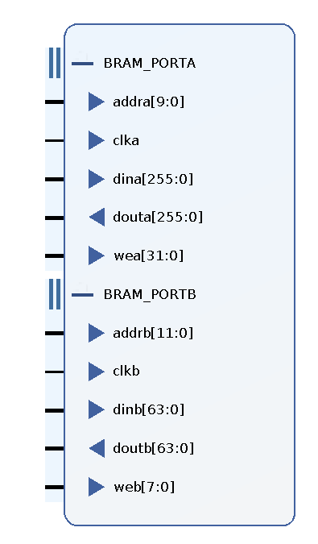

## CPU Features

1. Nearly complete MIPS32 Release 6 ISA support, without floating points and privileged instructions
2. five stages pipeline with 40M clock
3. Dedicated L1 32K Instrcution & 32K Data Cache
4. 512K Main Memory
5. GCC cross-compile support

## Support Instructions

1. Math:  addi, addiu, slti, sltiu, andi, ori, xori, lui, sll, **lsa**, srl, sra, sllv, srlv, srav, add, addu, sub, subu, and, or, xor, nor, slt, sltu
1. Mul/Div: **div**, **mod**, **divu**, **modu**, **mul**, **muh**, **mulu**, **muhu**
2. Load/Store: lb, lh, lw, lbu, lhu, sb, sh, sw
3. Branch/Jump: j, jal,jr(jalr), jalr, beq, bne, blez, bgtz, **REGIMMD: bltz, bgez, bal, nal**
4. SPECIAL_Rop: **selnez**, **seleqz**
4. SPECIAL3: **ins**, **ext**, BSHFL: **seb**, **seh**
5. Cache Operation: `sync 17, sync 16, sync 01`
8. TODO: 
   1. SPECIAL3.BDHFL: **bitswap**, **wsbh**
   2. PCREL: **addiupc**, **aluipc**, **auipc**, **lwpc**
   3. SPECIAL2:  **ALIGN**, **CLO**, **CLZ**


## IO Devices Support

1. UART: 4K TX/RX FIFO, support send / receive in C code
2. 24 switches & 24 leds
3. 5 buttons and the keypad
4. Seven-segment display

## CPU Design 


### Pipeline & Branch/Jump Implementation

The 5-stage pipeline is implemented exactly according to the textbook.

The Branch/Jump module is located in EX module to ensure right register data forwarding. Thanks to the branch delay slot, every instruction after a branch/jump operation is **always** `nop` to fill ID stage, which significant reduces the difficulty of implementation.

When Branch/Jump instruction is moved to EX module, the `jump_address` and `do_jump` is calculated and sent to PC register, PC register will check them at negedge and update its value to correct execution flow.

The pipeline status is:

- First posedge: `[PC IF] [ID nop] [EX jump]`
- First negedge and next posege: `[PC-do_jump IF] [ID jump_target_inst] [EX nop]`


### L1D / L1I Design & Implementation

L1D/L1I is designed as 32KiB Direct-Mapped Cache. L1D supports switching between Write-Back mode and Write-Through mode. 

The stall signal from L1I/L1D must be pulled up after posedge before negedge, when cache miss or MMIO request occurs. (which is a significant design error that limits the CPU frequency.)

#### Xillinx Block RAM & Distributed RAM

The Xillinx Block RAM supports three **Memory Type**: Single Port, Simple Dual Port, (Real) Dual Port.

- Single Port: only support read/write from one port, which is the same address.

  

- Simple Dual Port: Support write from Port A, and read from Port B at different address. This mode is suitable for L1I.

  

- Dual Port: Support read/write from Port A and Port B at different address, even use different clock. This mode is suitalbe for L1D, which can be used to fill/flush cache line from/to MMU, and read / write from CPU.

  

The Block RAM also can be configured into Byte Write mode (8 bits or 9bits, use 8 bits here):

| byte offset     | 7th Byte | 6th Byte | 5th Byte | 4th Byte | 3th Byte | 2th Byte | 1th Byte | 0th Byte |
| --------------- | -------- | -------- | -------- | -------- | -------- | -------- | -------- | -------- |
| Before Write    | 0xAA     | 0xBB     | 0xCC     | 0xDD     | 0xEE     | 0xFF     | 0x12     | 0x34     |
| Write Enable    | 0        | 0        | 1        | 1        | 0        | 0        | 0        | 0        |
| Write Data      | not used | not used | 0x56     | 0x78     | not used | not used | not used | not used |
| After Write clk | 0xAA     | 0xBB     | 0x56     | 0x78     | 0xEE     | 0xFF     | 0x12     | 0x34     |

Bytes whose corresponding wea bit is 1 will be changed. **This feature can be used to implement sh / sb.**

Port A contains 256 bits, 32 bytes, so the Write Enable for Port A (wea) is 32 bits width. Port B contains 64bits, 8 bytes, so the Write Enable for Port B (web) is 8 bits width. But The minimum data width for Port B is 64 bits, not 32 bits.



For more details, please check out Xillinx official document.

#### Distributed RAM

The Distributed RAM behaves like register array: `reg [18:0] cache_metadata [0:1023];`


**Read operation at Distributed RAM is async**, while the Block RAM read operation is sync to clock. Write Operation is sync to clock at both Block RAM and Distributed RAM.

The Distributed RAM can be used to store metadata in cache, such as `[dirty bit][valid bit][tag]`. The Async read feature can be used to determine operation on cache: r/w on cache line, replace, or flush then replace, and determine stall signal to `IF`.

Compared to use a register array, a Distributed RAM IPcore uses significantly less LUT resources and speeds up Synthesis. ( idk why:) )

- Extract Address:

  ```verilog
  wire c_work = l1_read || l1_write;
  wire        addr_is_mmio;
  wire [16:0] addr_tag    = l1_addr[31:15];
  wire [9:0]  addr_idx    = l1_addr[14:5];
  wire [2:0]  addr_w_off  = l1_addr[4:2];  // word offset
  wire [1:0]  addr_b_off  = l1_addr[1:0];  // byte offset
  wire        addr_h_word = l1_addr[2];    // access the high word, because port B is 64bit
  // cache addr: [tag 17b][idx 10b][3'b000][2'b00]
  ```

- Cache Distributed RAM, storing metadata

  ```verilog
  // L1 Cache, 1024 * 32B = 32KB
  // [dirty 1b][valid 1b][tag 17b]
  wire [16:0] c_wd_tag        = c_flush_dirty ? 17'b0 : addr_tag;
  wire [1:0]  c_wd_st         = c_flush_dirty ? 2'b00 : (!c_hit ? 2'b01 : {!write_through, 1'b1});    // status bits, when write_through, never mark dirty
  wire [18:0] cache_wd        = {c_wd_st, c_wd_tag};
  wire        cache_w;		// Distributed RAM write signal
  wire [18:0] c_o;			// metadata read out
  l1c_dismem dismem(
      .clk(sys_clk),
      .a(addr_idx),
      .d(cache_wd),
      .we(cache_w),
      .spo(c_o));
  ```

- Cache BRAM:

  ```verilog
  reg [3:0]   bram_w_type; 		// byte write enable 
  reg [31:0]  bram_w_word;        // the word write into cache
  wire [63:0] bram_w_dword = {bram_w_word, bram_w_word};
  								// simply duplicate it, control write through wea
  wire        bram_w_port_a;      // Port A write enable
  wire        bram_w_port_b;      // Port B write enable
  
  wire [31:0] bram_w_port_a_ext   = {32{bram_w_port_a}};
  wire [7:0]  bram_w_port_b_ext  = bram_w_port_b ? (addr_h_word ? {bram_w_type, 4'b0} : {4'b0, bram_w_type}) : 8'b0;
  
  wire [63:0] bram_dout;		   // Port B read out
  wire [255:0] bram_cl_out;	   // Port A read out
  dcache_bram cb(
      .clka(sys_clk),
      .addra(addr_idx),			// index value extracted from request addr
      .dina(mmu_l1_read_data),	
      .douta(bram_cl_out),
      .wea(bram_w_port_a_ext),
  
      .clkb(sys_clk),
      .addrb({addr_idx, addr_w_off[2:1]}),
      .dinb(bram_w_dword),
      .doutb(bram_dout),
      .web(bram_w_port_b_ext)
  );
  ```

- Cache Control Signals

  ```verilog
  wire [31:0] bram_out        = addr_h_word ? bram_dout[63:32] : bram_dout[31:0];
  wire        c_o_dirty       = c_o[18];
  wire        c_o_valid       = c_o[17];
  wire [16:0] c_o_tag         = c_o[16:0];
  wire        c_hit           = c_o_valid && c_o_tag == addr_tag;
  wire        c_flush_dirty   = c_o_dirty && c_o_valid && c_o_tag != addr_tag;
  // need to write back the dirty cache line first, then read out the new cache line
  
  wire        c_write_through = c_work && c_hit && write_through && l1_write && !mmu_l1_done;
  reg         c_write_through_d0;
  always @(posedge sys_clk) c_write_through_d0 <= c_write_through;
  
  wire need_flush_dirty = c_flush_dirty && c_work;
  reg flush_dirty_delayed;
  always @(posedge sys_clk) flush_dirty_delayed <= need_flush_dirty;
  wire flush_dirty_set_mmu_write = flush_dirty_delayed && need_flush_dirty;
  // Delay a clk to set MMU Write when flush dirty cache line.
  // A clk is needed to read out the cache line from Port A
  
  wire can_read = !addr_is_mmio && c_work && c_hit && l1_read && !can_read_d0;
  reg can_read_d0;
  always @(posedge sys_clk) can_read_d0 <= can_read;
  wire read_stall = can_read && !can_read_d0;
  // Read Operation needs two clock. A clk is needed to read out data from Port B
  
  wire disable_write_cache_wt = write_through && c_write_through_d0;
  // disable write to bram from port B during flush cache line under write through mode
  
  assign bram_w_port_a = !addr_is_mmio && c_work && !c_hit && !c_flush_dirty && mmu_l1_done;
  // Retrive new cache line, flush bram at posedge after next clock to posedge mmu_done
  
  assign bram_w_port_b = !addr_is_mmio && c_work && c_hit && l1_write && !disable_write_cache_wt;
  // write to cache line from Port B, when write hit
  
  assign cache_w = !addr_is_mmio && c_work && (c_hit && l1_write || !c_hit && mmu_l1_done) && !disable_write_cache_wt;
  // write to cache metadata, 1. after hit & write, 2. after unhit & read done
  ```

### L1 - MMU - MMIO Communication Protocol

The communication protocol is like AXI protocol. There are six lines to drive this protocol:

- Request: read request, write request, request address, write data,
- Response: done, read data

Constraints:

- `done` signal only holds for one clock, the corresponding read / write request signal must be pulled down at next posedge when `done` signal is high.

- Requester **must** hold request control/address/data lines until a done signal is present.

1. L1D: Read uncached


2. L1D: Write uncached


3. L1D: Read/Write dirty

   

### MMIO Design

The MMIO address is 0xFFFF0000 ~ 0xFFFFFFFF. When L1 I/D detects accessed address is a MMIO address, it forwards the read/write request to MMU, then MMU forwards this request to MMIO. MMIO dispatches this request to all MMIO devices and only one devices will response this request. MMIO will mux this output back to MMU.


The `mmio_work` in LED module indicates requesting address is targeted at MMIO-LED module, and MMIO mux response from MMIO-LED to MMU.  (The first two cycles are occupied by L1I)

```verilog
always @* begin
    if (addr_is_mmio) begin
        if (sw_work) begin
            mmio_done = sw_done;
            mmio_read_data = sw_rdata;
        end else if (rom_work) begin
            mmio_done = rom_done;
            mmio_read_data = rom_rdata;
        end else if (led_work) begin
            mmio_done = led_done;
            mmio_read_data = led_rdata;
        end
        // ....
    end else begin
        mmio_done = 0;
        mmio_read_data = 0;
    end
end
```


### MMIO Continuous Address Design

In LED and Switch MMIO module, every led/switch is mapped to a single-bit register. But their addresses are contiguous in a difference of 4. Then the addresses of 24 leds/switches can be expressed by an array:

```c
volatile int* mmio_led = (int*) 0xFFFF0100;

// mmio_led[2] -> the third led
```


### UART Design

The UART Module exposes 7 register to CPU.

```verilog
// UART
// Address: 0xFFFF0120 - 0xFFFF013F, 8 words, 32 bytes
//          0b100100000, 0b100111111
// RX VALID: 0xFFFF0120      // ro, set by RX_FIFO
// RX FIFO : 0xFFFF0124      // ro, read until RX_VALID is 0
// TX BUSY : 0xFFFF0128      // ro, indicating UART is sending
// TX FULL : 0xFFFF012C      // ro, set by TX_FIFO
// TX SEND : 0xFFFF0130      // rw, set by system, then pull down by UART
// TX FIFO : 0xFFFF0134      // wo, write by system
wire [2:0] _addr = mmio_addr[4:2];

wire acc_rx_valid   = mmio_work && _addr == 3'b000;  // ro
wire acc_rx_fifo    = mmio_work && _addr == 3'b001;  // ro
wire acc_tx_busy    = mmio_work && _addr == 3'b010;  // ro
wire acc_tx_full    = mmio_work && _addr == 3'b011;  // ro
wire acc_tx_send    = mmio_work && _addr == 3'b100;  // wr
wire acc_tx_fifo    = mmio_work && _addr == 3'b101;  // wo
```

 These address is defined in `utils/uart7.h`:

```c++
#define ADDR_UART_RX_VALID   0xFFFF0120
#define ADDR_UART_RX_FIFO    0xFFFF0124
#define ADDR_UART_TX_BUSY    0xFFFF0128
#define ADDR_UART_TX_FULL    0xFFFF012C
#define ADDR_UART_TX_SEND    0xFFFF0130
#define ADDR_UART_TX_FIFO    0xFFFF0134
```

The UART module contains two 4KiB FIFO, used for RX and TX. 

#### RX Procedure

The UART_RX module pulls up `uart_done` after a receive is done, then received data is appended to RX_FIFO. RX_VALID will be pulled up since there are data in RX_FIFO. 

The system will poll RX_VALID register. When RX_VALID is high, the system knows RX_FIFO contains uart data. Then system will read RX_FIFO register, one byte will be read out and send back to system.

#### TX Procedure

The system will wait until TX_FULL is not high, which means TX_FIFO can accept sent data from system. Then system will write to TX_FIFO register, one byte is appended to TX_FIFO. After appending all prepared data, TX_SEND register is written to 1, the UART module will read data from TX_FIFO and enable UART_TX module to send.

#### C codes

A sample code for send a null-terminated string and read string.

```c
#include "uart.h"
#include "../io.h"

void put_string(char* str) {
    while(*str) {
        while (read_io_u32(ADDR_UART_TX_FULL)) asm volatile ("":::"memory");
        write_io_u32(ADDR_UART_TX_FIFO, (unsigned int) *str);
        str++;
    }
    write_io_u32(ADDR_UART_TX_SEND, 1);
}

int read_string(char* dst, int max_len) {
    register int len = 0;
    while (len < max_len) {
        while (!read_io_u32(ADDR_UART_RX_VALID)) asm volatile ("":::"memory");
        // fifo is ready
        char get = read_io_u32(ADDR_UART_RX_FIFO) & 0xFF;
        if (get == ' ' || get == '\n' || get == '\t' || get == '\r')
            break;
        *dst = get;
        dst++;
        len++;
    }
    *dst = '\0';
    return len;
}
```

`read_io_u32` and `write_io_u32` is defined in `io.h`

```c
unsigned int read_io_u32(unsigned int address);
void write_io_u32(unsigned int address, unsigned int value);
```

and implemented in `io.s`, linked into one elf file.

```assembly
.text

.globl read_io_u32
read_io_u32:
    lw $v0, ($a0)
    nop
    jr $ra

.globl write_io_u32
write_io_u32:
    sw $a1, ($a0)
    nop
    jr $ra
```


### Bootloader Implementation

The Bootloader is stored in a Block ROM, which is connected under MMIO devices. **L1I can fetch instructions from MMIO-ROM and hold during stall.** The Bootloader starts at address `0xFFFFE000`, with 8KiB size in total.

Since the UART module can be accessed easily by c code, the UART loader is obviously written in c.

Bootloader procedures:

1. After reset, PC register is set to `0xFFFFE000`, L1I fetches instructions from MMIO-ROM.
2. The first instruction is fetched from the bootloader program entry point `__rom_start`, defined in `bootloader/rom.s`.
3. Enable L1D Write Through mode
4. Setup `$sp` register, jump to `bootloader` C function defined in `bootloader/bootloader.c`
5. Send UART messages, clear Main Memory
6. Receive Memory bin file from UART and write to Main Memory
7. Exit from C function `bootloader`.
8. Disable L1D Write Through mode, and invalid all L1I cache
9. Jump to address `0x00001000`, which is the main code entry point, defined in `start.s`
10. Jump to the label `main`, which is the main function in every user-program C file.

rom.s :

```assembly
.globl __rom_start
.globl bootloader
.section .rom
__rom_start:
.rept 10
    nop
.endr
    sync 17
    # Enable L1D write through mode, make sure every write is sync to Main Memory
    
    li $sp, 0x80000
    # ROM Stack: 0x80000 - 0x7FC00
    jal bootloader

    # disable write through
    sync 16
    # dismiss all instruction cache
    sync 01

    li $sp, 0x18000
    .set noat
    li $at, 0x00001000
    jalr $at
    j __rom_start

	# ROM Mode
    # text: 0xE000 0b1110000000000000
    # data: 0xFA00 0b1111101000000000
    # end:  0xFFFF 0b1111111111111111
    # size: 0x2000      11111111111
    # 8K size
```

start.s:

```assembly
.globl __start
.globl main
.section .start
__start:
    j main
```


### Cross-Compile Support

0. CPU must implement some Release 6 Instructions and changes, such as jr and jalr.

1. Compile .c / .s files into .o object files.

2. Link them and setup entry point
3. Stripe unused sections from elf file
4. dump the memory
